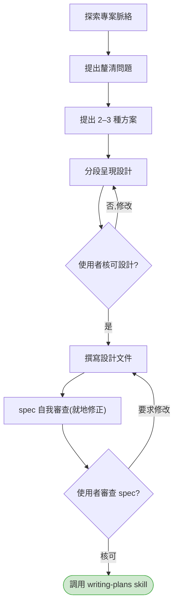
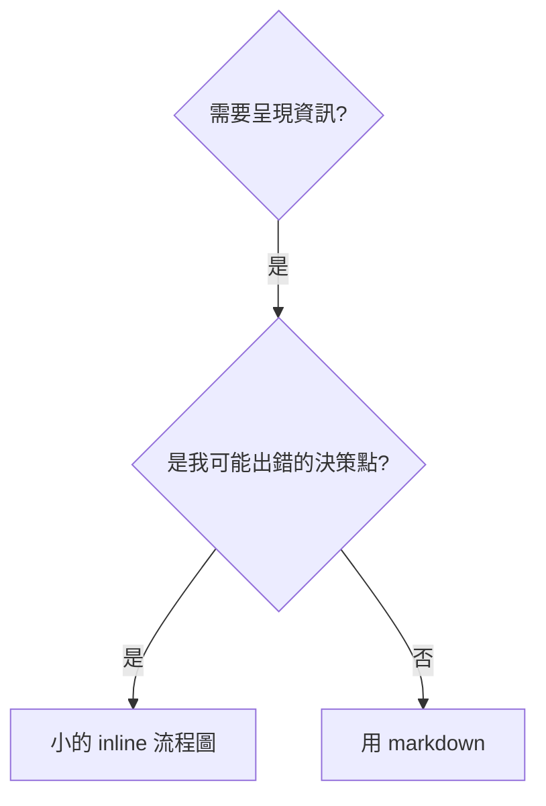
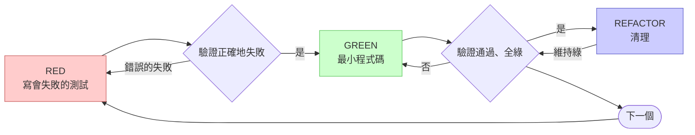
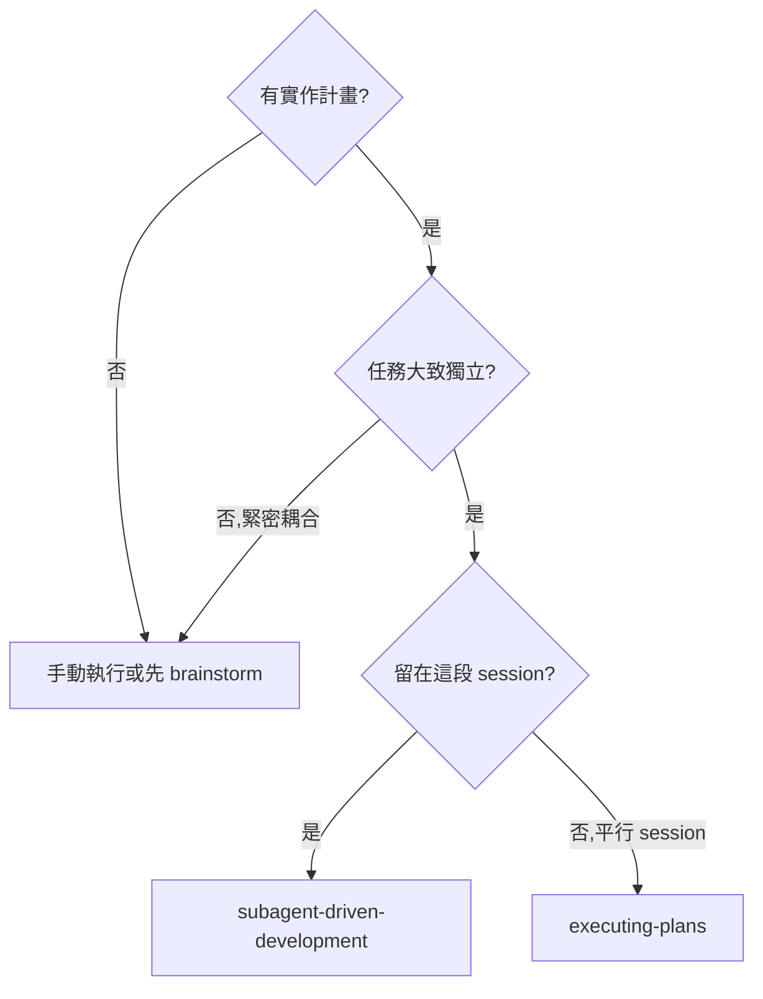
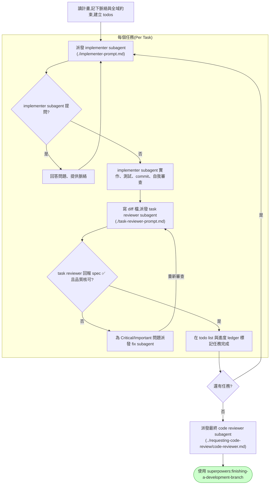
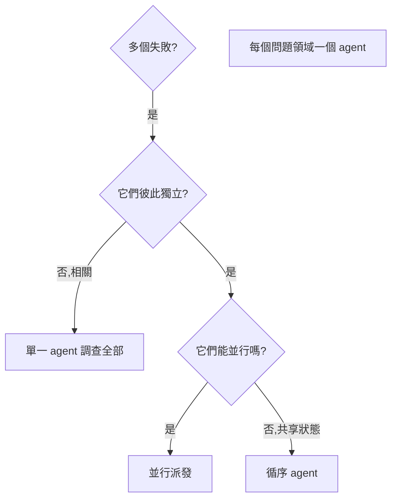
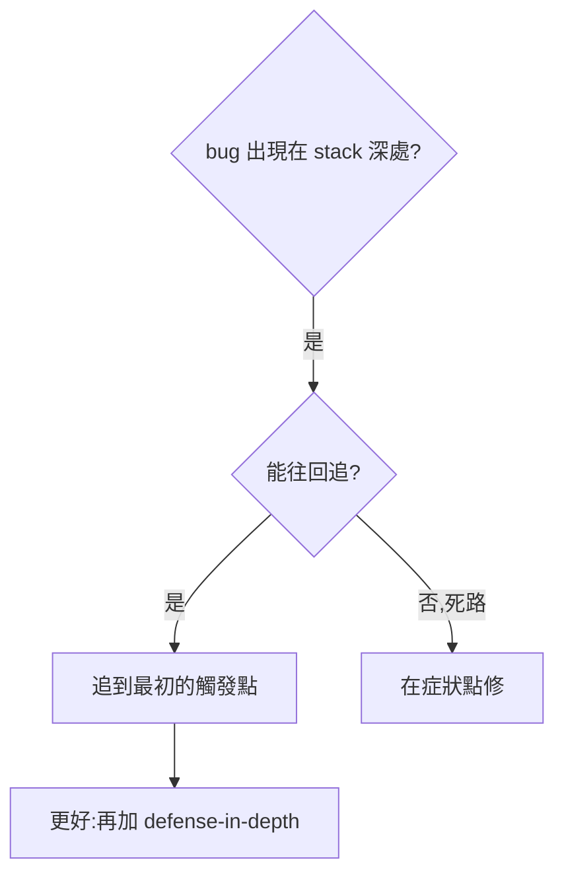
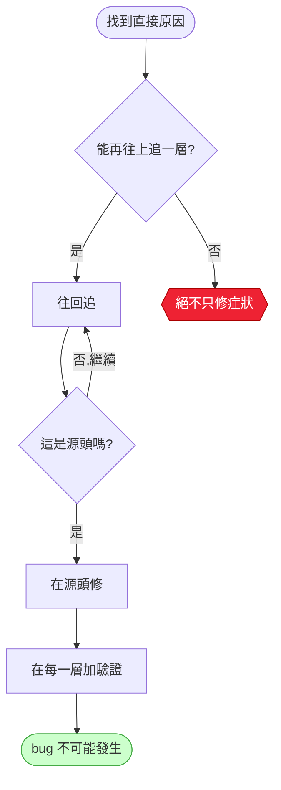
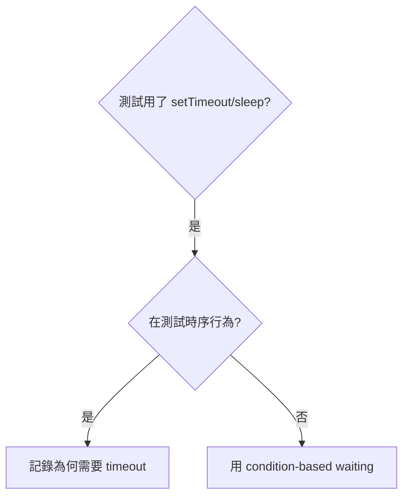

# Skill 流程圖（Mermaid 對照）

> **這是一份「在地化 review 輔助」，不是 canonical 來源。**
>
> 每個 skill 的流程圖真理來源，是它 `SKILL.md` 裡的 ` ```dot `(Graphviz)區塊——那才是 agent 執行時讀到的內容,也是 `skills/writing-skills/render-graphs.js` 會 render 的對象。GitHub **不會**自動渲染 ` ```dot `，所以本頁把同樣的流程用 **Mermaid** 重畫一遍，好讓在 GitHub 上 review 的中文使用者能直接看到圖。
>
> 這些 Mermaid 圖是**便利檢視用**：節點文字譯成中文以利吸收，但 skill ID、檔案路徑、技術術語（`RED`／`GREEN`／`REFACTOR`、`setTimeout`／`sleep`、`defense-in-depth` 等）維持原文。若本頁與某個 `SKILL.md` 的 ` ```dot ` 有出入,**以 `SKILL.md` 為準**。canonical skill 不因本頁而有任何改動。

## 目錄

- [brainstorming —— 設計打磨流程](#brainstorming)
- [writing-skills —— 何時用流程圖](#writing-skills)
- [test-driven-development —— RED-GREEN-REFACTOR 循環](#test-driven-development)
- [subagent-driven-development —— 何時使用](#subagent-driven-development-when)
- [subagent-driven-development —— 執行流程](#subagent-driven-development-process)
- [dispatching-parallel-agents —— 何時使用](#dispatching-parallel-agents)
- [systematic-debugging / root-cause-tracing —— 何時使用](#root-cause-tracing-when)
- [systematic-debugging / root-cause-tracing —— 原則](#root-cause-tracing-principle)
- [systematic-debugging / condition-based-waiting —— 何時使用](#condition-based-waiting)

---

<a id="brainstorming"></a>
## brainstorming —— 設計打磨流程

Canonical:[`skills/brainstorming/SKILL.md`](../../skills/brainstorming/SKILL.md)



---

<a id="writing-skills"></a>
## writing-skills —— 何時用流程圖

Canonical:[`skills/writing-skills/SKILL.md`](../../skills/writing-skills/SKILL.md)



---

<a id="test-driven-development"></a>
## test-driven-development —— RED-GREEN-REFACTOR 循環

Canonical:[`skills/test-driven-development/SKILL.md`](../../skills/test-driven-development/SKILL.md)



---

<a id="subagent-driven-development-when"></a>
## subagent-driven-development —— 何時使用

Canonical:[`skills/subagent-driven-development/SKILL.md`](../../skills/subagent-driven-development/SKILL.md)



---

<a id="subagent-driven-development-process"></a>
## subagent-driven-development —— 執行流程

Canonical:[`skills/subagent-driven-development/SKILL.md`](../../skills/subagent-driven-development/SKILL.md)



---

<a id="dispatching-parallel-agents"></a>
## dispatching-parallel-agents —— 何時使用

Canonical:[`skills/dispatching-parallel-agents/SKILL.md`](../../skills/dispatching-parallel-agents/SKILL.md)



---

<a id="root-cause-tracing-when"></a>
## systematic-debugging / root-cause-tracing —— 何時使用

Canonical:[`skills/systematic-debugging/root-cause-tracing.md`](../../skills/systematic-debugging/root-cause-tracing.md)



---

<a id="root-cause-tracing-principle"></a>
## systematic-debugging / root-cause-tracing —— 原則

Canonical:[`skills/systematic-debugging/root-cause-tracing.md`](../../skills/systematic-debugging/root-cause-tracing.md)



---

<a id="condition-based-waiting"></a>
## systematic-debugging / condition-based-waiting —— 何時使用

Canonical:[`skills/systematic-debugging/condition-based-waiting.md`](../../skills/systematic-debugging/condition-based-waiting.md)


