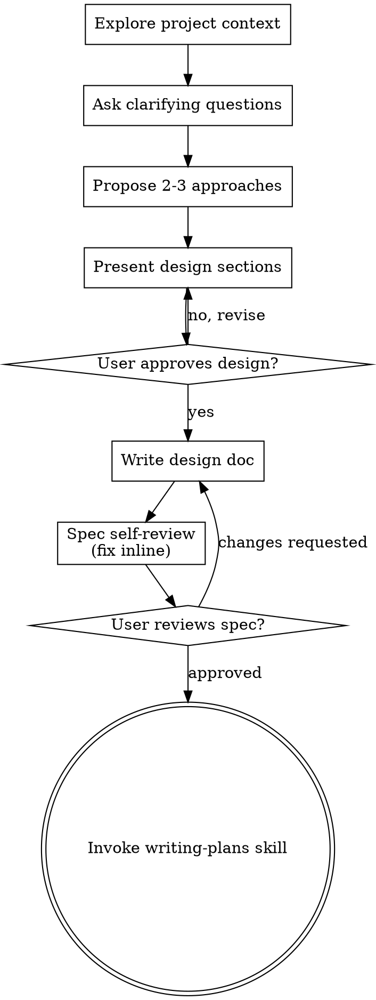

# 將想法整理成設計

透過自然的協作對話，把初步想法轉化為完整的設計與規格。

先理解目前的專案背景，再一次提出一個問題來逐步釐清想法。當你已經理解要建立什麼之後，分段提出設計並取得使用者批准。

<HARD-GATE>
在提出設計並取得使用者批准之前，**不得（Do NOT）**呼叫任何實作型 skill、撰寫任何程式碼、建立專案骨架，或採取任何實作行動。這項規則適用於**每一個**專案，不因任務看起來簡單而例外。
</HARD-GATE>

## 反模式：「這太簡單，不需要設計」

每個專案都必須經過這個流程。待辦清單、只有一個 function 的小工具、設定檔修改——全部都一樣。「簡單」的專案最容易因未被檢查的假設而浪費時間。真正簡單的專案，設計可以只有幾句話，但你仍然**必須（MUST）**提出設計並取得批准。

## Checklist

你**必須（MUST）**為下列每個項目建立 task，並依序完成：

1. **探索專案背景**——檢查檔案、文件與近期 commits
2. **在真正需要時才提供 Visual Companion**——不要一開始就詢問。第一次遇到「用圖比文字更清楚」的問題時，才用一則獨立訊息提出。使用者同意後，為其開啟瀏覽器分頁。如果整個過程都沒有視覺問題，就完全不要提出。詳見下方 Visual Companion 章節。
3. **提出釐清問題**——一次一個，理解目的、約束與成功判準
4. **提出 2–3 個方案**——說明取捨與你的推薦
5. **呈現設計**——依複雜度分段，並在每一段取得使用者批准
6. **撰寫設計文件**——儲存至 `docs/superpowers/specs/YYYY-MM-DD-<topic>-design.md` 並 commit
7. **規格自我審查**——快速檢查 placeholder、矛盾、歧義與範圍，詳見下方說明
8. **使用者審查已寫入的規格**——請使用者先審查規格檔案，再繼續
9. **轉入實作規劃**——呼叫 `writing-plans` skill，建立 implementation plan

## 流程圖

**這個流程的終止狀態是呼叫 `writing-plans`。** 不得（Do NOT）呼叫 `frontend-design`、`mcp-builder` 或任何其他實作型 skill。`brainstorming` 完成後，**只能（ONLY）**呼叫 `writing-plans`。

## 詳細流程

### 理解想法

- 先檢查目前專案狀態，包括檔案、文件與近期 commits
- 在提出細節問題前，先評估範圍。如果需求包含多個彼此獨立的子系統，例如「建立一個包含聊天、檔案儲存、計費與分析的平台」，立即指出範圍過大。不要在一個本來就需要拆分的專案上，花大量問題逐一細化全部細節。
- 如果專案太大，無法用單一 spec 表達，協助使用者拆成數個子專案：有哪些獨立部分、彼此如何關聯、應依什麼順序進行。接著只針對第一個子專案執行正常的 brainstorming 流程。每個子專案都要各自經過 spec → plan → implementation 週期。
- 對範圍適當的專案，一次提出一個問題，逐步釐清想法
- 可以時優先使用選擇題，但開放式問題也可以
- 每則訊息只能問一個問題；如果同一主題需要深入探索，拆成多個問題
- 聚焦理解：目的、約束與成功判準

### 探索不同方案

- 提出 2–3 個不同方案，並說明各自取捨
- 以對話方式呈現選項，說明你的推薦與理由
- 先提出你最推薦的方案，再解釋原因

### 呈現設計

- 當你認為自己已經理解要建立什麼時，開始提出設計
- 每個段落的長度依複雜度調整：簡單內容只需幾句；複雜內容最多約 200–300 字
- 每一段之後都要詢問使用者目前看起來是否正確
- 必須涵蓋：架構、元件、資料流、錯誤處理與測試
- 如果有任何內容不合理，準備退回前一步重新釐清

### 為隔離性與清晰度而設計

- 將系統拆成較小的單元。每個單元只有一個明確目的，透過定義清楚的介面溝通，並且可以被獨立理解與測試。
- 對每個單元，你都應能回答：它做什麼、如何使用、依賴什麼？
- 使用者能否在不閱讀內部實作的情況下理解單元作用？內部實作改變時，能否不破壞使用者？如果不能，代表邊界仍需改善。
- 小而邊界清楚的單元也更容易讓你可靠地工作：你能在 context 中完整掌握它，修改也較不容易出錯。檔案持續變大，通常代表它承擔了太多責任。

### 在既有程式碼庫中工作

- 提出修改前，先探索目前結構並遵循既有模式
- 如果既有問題會直接影響本次工作，例如檔案過大、邊界不清或責任糾纏，把針對性的改善納入設計；就像優秀工程師會在工作範圍內改善所接觸的程式碼
- 不要提出與目前目標無關的重構。只處理真正服務本次目標的改善

## 設計完成之後

### 文件

- 將已確認的設計（spec）寫入 `docs/superpowers/specs/YYYY-MM-DD-<topic>-design.md`
  - 如果使用者指定其他 spec 位置，使用者偏好優先
- 如果有 `elements-of-style:writing-clearly-and-concisely` skill，使用它
- 將設計文件 commit 到 git

### Spec 自我審查

寫完 spec 後，用全新的角度重新閱讀：

1. **Placeholder 掃描：**是否有 `TBD`、`TODO`、未完成段落或模糊需求？直接修正。
2. **內部一致性：**各段是否互相矛盾？架構是否與功能描述一致？
3. **範圍檢查：**是否足夠聚焦，可以進入單一 implementation plan？還是應再拆分？
4. **歧義檢查：**任何需求是否可能有兩種解讀？如果有，選定一種並明確寫出。

直接在文件內修正問題即可。不需要再做第二輪自我審查；修好後繼續下一步。

### 使用者審查關卡

Spec 自我審查通過後，請使用者先審查已寫入的文件，再往下進行：

> 「Spec 已寫入並 commit 至 `<path>`。請先審查這份文件；如果希望修改任何內容，請告訴我。確認後我們再開始撰寫 implementation plan。」

等待使用者回覆。如果使用者要求修改，完成修改並重新執行 spec 自我審查。只有在使用者批准後才能繼續。

### 實作

- 呼叫 `writing-plans` skill，建立詳細的 implementation plan
- 不得（Do NOT）呼叫任何其他 skill。下一步就是 `writing-plans`

## 核心原則

- **一次一個問題**——不要同時丟出多個問題造成負擔
- **優先選擇題**——可以時使用選擇題，通常比開放式問題更容易回答
- **徹底執行 YAGNI**——從所有設計中移除目前不需要的功能
- **探索替代方案**——在決定前，永遠提出 2–3 個方案
- **漸進式確認**——分段呈現設計，取得批准後再繼續
- **保持彈性**——內容不合理時，退回並重新釐清

## Visual Companion

Visual Companion 是一個瀏覽器式輔助工具，用於 brainstorming 過程中呈現 mockup、diagram 與視覺選項。它是一項工具，不是一種模式。使用者接受 Visual Companion，只代表你可以在適合視覺呈現的問題上使用它；**不代表**每個問題都要透過瀏覽器進行。

### 在真正需要時才提出

不要在一開始就提供 Visual Companion。等到某個問題確實「看圖比讀文字更容易理解」時——真正涉及 mockup、layout 或 diagram，而不只是話題與 UI 有關——才用一則獨立訊息提出：

> 「下一部分用圖呈現可能會比較清楚。我可以在瀏覽器分頁中整理 mockup、diagram 和比較選項，讓我們邊看邊討論。這個功能仍然很新，也可能消耗較多 token。要使用嗎？我會為你開啟分頁。」

**這個詢問必須（MUST）單獨成為一則訊息。** 只能包含這項詢問，不可同時附帶釐清問題、摘要或其他內容。等待使用者回覆。如果使用者同意，以 `--open` 啟動 server，讓瀏覽器自動開啟第一個畫面。如果使用者拒絕，就繼續只使用文字；除非使用者之後主動再次提起，否則不要重複詢問。

### 每個問題都獨立判斷

即使使用者已同意使用 Visual Companion，對**每一個問題**仍要單獨判斷應使用瀏覽器或 terminal。判斷標準是：**使用者看到它，是否會比讀文字更容易理解？**

- **使用瀏覽器：**真正具有視覺性的內容，例如 mockup、wireframe、layout 比較、架構圖與並排視覺設計
- **使用 terminal：**文字型內容，例如需求問題、概念選擇、取捨清單、A／B／C／D 文字選項與範圍決策

討論 UI 不代表問題一定具有視覺性。「personality 在這個情境中代表什麼？」是概念問題，使用 terminal。「哪一種 wizard layout 比較好？」是視覺問題，使用瀏覽器。

如果使用者同意使用 Visual Companion，在繼續前先閱讀詳細指南：

`skills/brainstorming/visual-companion.md`
