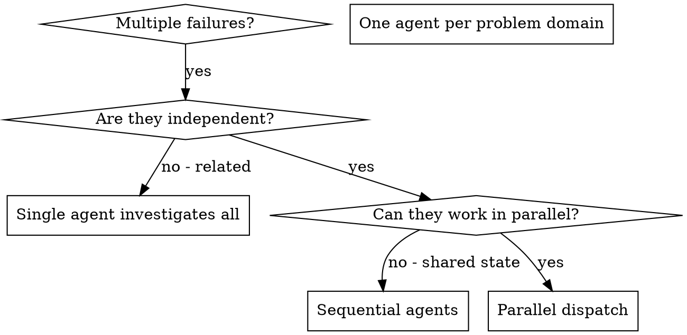

# 派遣平行 agent（Dispatching Parallel Agents）

## 概觀

你把任務委派給具備隔離 context 的專門 agent。透過精準地打造它們的指示與 context，你確保它們保持專注並成功完成任務。它們絕對不應繼承你這個 session 的 context 或歷史——你為它們精確建構所需的一切。這也保留了你自己的 context 供協調工作使用。

當你面對多個不相關的失敗（不同的測試檔、不同的子系統、不同的 bug）時，逐一循序調查是浪費時間。每個調查都是獨立的，可以平行進行。

**核心原則：**每個獨立的問題領域派一個 agent。讓它們並行工作。

## 何時使用



**在以下情況使用：**
- 3 個以上測試檔因不同根本原因失敗
- 多個子系統各自獨立壞掉
- 每個問題不需其他問題的 context 就能理解
- 各調查之間沒有共享狀態

**不要在以下情況使用：**
- 失敗彼此相關（修一個可能就修好其他）
- 需要理解完整的系統狀態
- agent 會互相干擾

## 模式

### 1. 辨識獨立領域

依「壞了什麼」把失敗分組：
- 檔案 A 的測試：工具核准流程
- 檔案 B 的測試：批次完成行為
- 檔案 C 的測試：中止（abort）功能

每個領域都是獨立的——修工具核准不會影響中止測試。

### 2. 建立聚焦的 agent 任務

每個 agent 拿到：
- **具體範圍：**一個測試檔或子系統
- **清楚目標：**讓這些測試通過
- **約束：**不要改動其他程式碼
- **預期輸出：**你發現與修正了什麼的摘要

### 3. 平行派遣

在同一則回應裡發出全部三個 subagent 派遣——它們會平行執行：

```text
Subagent (general-purpose): "Fix agent-tool-abort.test.ts failures"
Subagent (general-purpose): "Fix batch-completion-behavior.test.ts failures"
Subagent (general-purpose): "Fix tool-approval-race-conditions.test.ts failures"
# All three run concurrently.
```

在一則回應裡多個派遣呼叫 = 平行執行。一則回應一個 = 循序執行。

### 4. 審查與整合

當 agent 回來時：
- 讀每一份摘要
- 確認各修正不衝突
- 跑完整測試套件
- 整合所有變更

## agent 提示（Prompt）結構

好的 agent 提示是：
1. **聚焦**——一個清楚的問題領域
2. **自足**——理解問題所需的全部 context
3. **明確指定輸出**——agent 應該回傳什麼？

```markdown
Fix the 3 failing tests in src/agents/agent-tool-abort.test.ts:

1. "should abort tool with partial output capture" - expects 'interrupted at' in message
2. "should handle mixed completed and aborted tools" - fast tool aborted instead of completed
3. "should properly track pendingToolCount" - expects 3 results but gets 0

These are timing/race condition issues. Your task:

1. Read the test file and understand what each test verifies
2. Identify root cause - timing issues or actual bugs?
3. Fix by:
   - Replacing arbitrary timeouts with event-based waiting
   - Fixing bugs in abort implementation if found
   - Adjusting test expectations if testing changed behavior

Do NOT just increase timeouts - find the real issue.

Return: Summary of what you found and what you fixed.
```

## 常見錯誤

**❌ 太廣：**「修全部的測試」——agent 會迷失
**✅ 具體：**「修 agent-tool-abort.test.ts」——聚焦範圍

**❌ 沒有脈絡：**「修那個 race condition」——agent 不知道在哪
**✅ 有脈絡：**貼上錯誤訊息與測試名稱

**❌ 沒有約束：**agent 可能把全部重構
**✅ 有約束：**「不得（Do NOT）改動正式程式碼」或「只改測試」

**❌ 模糊的輸出：**「修一下」——你不知道改了什麼
**✅ 具體：**「回傳根本原因與變更的摘要」

## 何時不要使用

**相關的失敗：**修一個可能就修好其他——先一起調查
**需要完整 context：**理解需要看到整個系統
**探索式除錯：**你還不知道哪裡壞了
**共享狀態：**agent 會互相干擾（編輯同一批檔案、使用同一批資源）

## 來自實際 session 的範例

**情境：**大型重構（refactoring）後，3 個檔案共 6 個測試失敗

**失敗：**
- agent-tool-abort.test.ts：3 個失敗（timing 問題）
- batch-completion-behavior.test.ts：2 個失敗（工具沒有執行）
- tool-approval-race-conditions.test.ts：1 個失敗（execution count = 0）

**決定：**獨立領域——abort 邏輯、批次完成、race condition 彼此分離

**派遣：**
```
Agent 1 → Fix agent-tool-abort.test.ts
Agent 2 → Fix batch-completion-behavior.test.ts
Agent 3 → Fix tool-approval-race-conditions.test.ts
```

**結果：**
- Agent 1：把 timeout 換成 event-based waiting（以事件為基礎的等待）
- Agent 2：修正 event 結構 bug（threadId 放錯位置）
- Agent 3：加上等待非同步工具執行完成

**整合：**所有修正互相獨立、無衝突、完整套件全綠

**省下的時間：**3 個問題平行解決，相對於循序

## 主要好處

1. **平行化**——多個調查同時進行
2. **聚焦**——每個 agent 範圍窄，要追蹤的 context 較少
3. **獨立**——agent 之間不互相干擾
4. **速度**——用 1 個的時間解決 3 個問題

## 驗證

當 agent 回來後：
1. **審查每一份摘要**——理解改了什麼
2. **檢查衝突**——agent 是否編輯了同一段程式碼？
3. **跑完整套件**——驗證所有修正一起運作
4. **抽查**——agent 可能犯系統性錯誤

## 真實世界的影響

來自一次除錯 session（2025-10-03）：
- 3 個檔案共 6 個失敗
- 平行派遣 3 個 agent
- 所有調查並行完成
- 所有修正成功整合
- agent 變更之間零衝突
