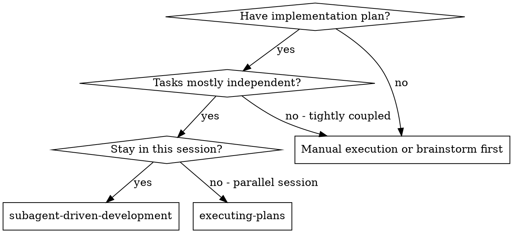
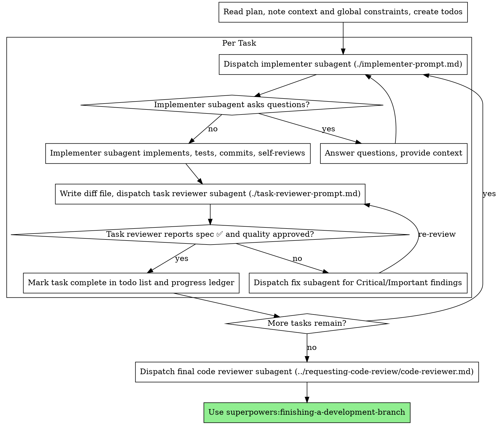

# 子代理驅動開發（Subagent-Driven Development）

透過為每個任務派遣一個全新的 implementer subagent 來執行計畫,每個任務之後做一次 task review（規格符合度＋程式碼品質）,並在最後做一次涵蓋整個 branch 的廣泛 review。

**為何用 subagent：**你把任務委派給具備隔離 context 的專門 agent。透過精準地打造它們的指示與 context,你確保它們保持專注並成功完成任務。它們絕對不應繼承你這個 session 的 context 或歷史——你為它們精確建構所需的一切。這也保留了你自己的 context 供協調工作使用。

**核心原則：**每個任務用全新 subagent ＋ task review（規格＋品質）＋ 最後廣泛 review ＝ 高品質、快速迭代

**敘述（Narration）：**在工具呼叫之間,最多只敘述一短行——ledger
與工具結果才是記錄的載體。

**連續執行：**任務之間不要停下來向你合作的人類使用者確認。不間斷地執行計畫中的所有任務。唯一該停下的理由是：你無法解決的 BLOCKED 狀態、真正阻礙進度的模糊之處,或所有任務都已完成。「我該繼續嗎？」這類提問與進度摘要會浪費他們的時間——他們要你執行計畫,那就執行。

## 何時使用



**對比 Executing Plans（平行 session）：**
- 同一個 session（不切換 context）
- 每個任務用全新 subagent（不污染 context）
- 每個任務之後 review（規格符合度＋程式碼品質）,最後做廣泛 review
- 更快迭代（任務之間不需 human-in-loop）

## 流程



## 起飛前計畫審查（Pre-Flight Plan Review）

在派遣 Task 1 之前,把計畫掃一遍找出衝突：

- 彼此矛盾、或與計畫的 Global Constraints 矛盾的任務
- 任何計畫明文要求、但 review 評分準則視為缺陷的東西（沒有斷言任何事的
  測試、邏輯區塊的逐字重複）

把你找到的一切以「一次性打包的提問」呈給你合作的人類使用者——每一項發現都附上要求它的計畫原文,詢問以何者為準——在開始執行之前提出,而不是計畫進行到一半時每發現一項就打斷一次。若掃描結果乾淨,就不作聲、直接進行。對於只有在實作時才浮現的衝突,review 迴圈仍是安全網。

## 模型選擇

每個角色都用「能勝任的最弱模型」,以節省成本、提升速度。

**機械式的實作任務**（孤立的 function、清楚的規格、1–2 個檔案）：用快而便宜的模型。當計畫規格詳盡時,多數實作任務都是機械式的。

**整合與判斷型任務**（多檔協調、模式比對、除錯）：用標準模型。

**架構與設計型任務**：用手上最強的模型。最後那次涵蓋整個 branch 的
review 就屬於這類——用手上最強的模型派遣它,而不是 session 的預設模型。

**Review 任務**：以同樣的判斷來選模型,依 diff 的大小、複雜度與風險縮放。小型機械式 diff 不需要最強模型;細微的並行（concurrency）變更則需要。

**派遣 subagent 時,一律明確指定模型。**省略模型會繼承你 session 的模型——往往是最強也最貴的——這會無聲地讓本節失效。

**回合數比 token 單價更重要。**wall-clock 與 context 成本取決於 subagent 花了多少回合,而最便宜的模型在多步驟工作上經常多花 2–3 倍回合——整體反而更貴。reviewer 與「從散文描述工作」的 implementer,以中階模型為下限。當任務的計畫文字已包含要寫的完整程式碼時,實作就只是謄寫加測試：那種 implementer 用最便宜的等級。單檔機械式修正也用最便宜的等級。

**任務複雜度訊號（實作任務）：**
- 動到 1–2 個檔案且規格完整 → 便宜模型
- 動到多個檔案且有整合考量 → 標準模型
- 需要設計判斷或對整個程式庫的廣泛理解 → 最強模型

## 處理 Implementer 狀態

Implementer subagent 會回報四種狀態之一。分別妥善處理：

**DONE：**產生 review package(在本 skill 目錄下執行 `scripts/review-package BASE HEAD`——它會印出所寫入的唯一檔案路徑;BASE 是你在派遣 implementer 之前記下的 commit——絕對不要（never）用 `HEAD~1`,那會無聲地丟掉多 commit 任務中除最後一個以外的所有 commit),然後用印出的路徑派遣 task reviewer。

**DONE_WITH_CONCERNS：**implementer 完成了工作,但標示了疑慮。在繼續之前先讀這些疑慮。若疑慮關乎正確性或範圍,先處理再 review。若只是觀察(例如「這個檔案越來越大」),記下來並進行 review。

**NEEDS_CONTEXT：**implementer 需要未提供的資訊。補上缺少的 context 再重新派遣。

**BLOCKED：**implementer 無法完成任務。評估阻礙點：
1. 若是 context 問題,補充 context 並用同一個模型重新派遣
2. 若任務需要更多推理,用更強的模型重新派遣
3. 若任務太大,拆成更小的片段
4. 若是計畫本身有錯,上呈給人類

**絕對不要（Never）**忽略上呈,或在毫無改變的情況下硬要同一個模型重試。如果 implementer 說它卡住了,就一定有東西需要改變。

## 處理 Reviewer 的 ⚠️ 項目

task reviewer 可能回報「⚠️ Cannot verify from diff」項目——那些位於未變更程式碼中、或跨越多個任務的需求。這些不會擋住 review 的其餘部分,但你必須（must）在標記任務完成之前逐一自行解決：你握有 reviewer 所缺的計畫與跨任務 context。若你確認某項確實是缺口,就把它當作未通過的規格 review——退回給 implementer 並重新 review。

## 建構 Reviewer 提示（Prompt）

逐任務的 review 是「任務範圍」的關卡。廣泛 review 只發生一次,在最後那次涵蓋整個 branch 的 review。當你填寫 reviewer 模板時：

- 不要加上「檢查所有用法」或「有需要就跑 race 測試」這類開放式指示,除非
  有具體、針對該任務的理由
- 不要要求 reviewer 重跑 implementer 已在同一份程式碼上跑過的測試——
  implementer 的報告已載有測試證據
- 不要替 reviewer 預先裁定發現——絕對不要（never）指示 reviewer 忽略或
  不要標記某個特定問題。若你認為某項發現會是誤報,就讓 reviewer 提出、
  再在 review 迴圈中裁決它。如果你正在寫的 prompt 裡出現「do not flag」、
  「don't treat X as a defect」、「at most Minor」或「the plan chose」——
  停：你正在預先裁定,通常是為了替自己省掉一次 review 迴圈。
- 你交給 reviewer 的 global-constraints 區塊是它的注意力透鏡。從計畫的
  Global Constraints 段落或規格中逐字（verbatim）複製具約束力的需求：
  確切的值、確切的格式,以及元件之間所陳述的關係(「與 X 相同的佈局」、
  「符合 Y」)。reviewer 的模板已載有流程規則(YAGNI、測試衛生、review
  方法)——constraints 區塊是給「這個專案的規格所要求的東西」。
- 把 diff 當作檔案交給 reviewer：執行本 skill 的
  `scripts/review-package BASE HEAD`,把它印出的檔案路徑交給 reviewer(或在
  沒有 bash 時:對該範圍執行 `git log --oneline`、`git diff --stat` 與
  `git diff -U10`,重導到一個唯一命名的檔案)。輸出永遠不會進入你自己的
  context,而 reviewer 只需一次 Read 呼叫就能看到 commit 清單、stat 摘要,
  以及帶 context 的完整 diff。用你在派遣 implementer 之前記下的 BASE——
  絕對不要（never）用 `HEAD~1`,那會無聲地截斷多 commit 任務。
- 一份派遣 prompt 描述的是「一個任務」,不是 session 的歷史。不要把累積的
  前置任務摘要(「Tasks 1–3 之後的狀態」)貼進後續派遣——某次真實 session
  的派遣達到 42k 字元,其中 99% 是貼上的歷史。一個全新的 subagent 需要的
  是它的任務、它會碰到的介面,以及 global constraints。別無其他。
- 為 Critical 與 Important 發現派遣 fix subagent。隨手把 Minor 發現記進
  進度 ledger,並讓最後那次整個 branch 的 review 指向該清單,好讓它分類
  哪些必須在 merge 前修掉。沒人讀的彙整就等於無聲丟棄。
- 被標為 plan-mandated 的發現——或任何與計畫文字要求相衝突的發現——是
  人類的決定,一如任何計畫矛盾：呈上該發現與計畫原文,詢問以何者為準。
  不要因為計畫要求就駁回該發現,也不要在未詢問的情況下派遣一個與計畫
  相衝突的修正。
- 最後那次整個 branch 的 review 也拿到一份 package：執行
  `scripts/review-package MERGE_BASE HEAD`(MERGE_BASE ＝ branch 起始的
  commit,例如 `git merge-base main HEAD`),並把印出的路徑放進最後的
  review 派遣,讓最後的 reviewer 讀一個檔案,而不必用 git 指令重新推導
  branch diff。
- 每一次 fix 派遣都帶著 implementer 契約：fix subagent 重跑涵蓋其變更的
  測試並回報結果。在派遣中指名涵蓋的測試檔——一行的修正不需要整個
  suite。在重新派遣 reviewer 之前,確認 fix 報告包含涵蓋的測試、所執行的
  指令,以及輸出;三者齊備後才派遣 re-review。
- 若最後那次整個 branch 的 review 回報了發現,派遣「一個」帶著完整發現
  清單的 fix subagent——而不是每個發現派一個修正者。逐發現的修正者各自
  重建 context 並重跑 suite;某次真實 session 的最終 review 修正潮,花費
  比它所有任務加起來還多。

## 檔案交接

你貼進派遣 prompt 的一切——以及 subagent 印回的一切——會在這個 session 的其餘時間常駐於你的 context,並在之後每個回合被重讀。把產物（artifact）當作檔案交接：

- **Task brief：**在派遣 implementer 之前,執行本 skill 的
  `scripts/task-brief PLAN_FILE N`——它會把該任務的完整文字抽取到一個
  唯一命名的檔案並印出路徑。組織派遣時要讓 brief 維持為需求的唯一來源。
  你的派遣應包含：(1) 一行說明這個任務在專案中的位置;(2) brief 路徑,以
  「先讀這個——這是你的需求,含要逐字（verbatim）使用的確切值」介紹;
  (3) 前置任務中 brief 無從得知的介面與決定;(4) 你對 brief 中察覺到的
  任何模糊之處的裁定;(5) report 檔路徑與 report 契約。確切的值(數字、
  magic string、簽章、測試案例)只出現在 brief 裡。
- **Report 檔：**implementer 的 report 檔以 brief 為名(brief
  `…/task-N-brief.md` → report `…/task-N-report.md`),並放進派遣 prompt。
  implementer 把完整報告寫在那裡,只回傳狀態、commit、一行測試摘要,以及
  疑慮。
- **Reviewer 的輸入：**task reviewer 拿到三個路徑——同一個 brief 檔、
  report 檔,以及 review package——外加約束該任務的 global constraints。
- Fix 派遣把它們的 fix 報告(含測試結果)附加到同一個 report 檔,並回傳一段
  簡短摘要;re-review 讀取更新後的檔案。

## 持久化進度

對話記憶無法在 compaction 後存活。在真實 session 中,弄丟進度的 controller 曾把整段已完成的任務序列重新派遣一次——這是觀察到的單一最昂貴失敗。把進度記在 ledger 檔裡,而不是只記在 todo 裡。

- 在 skill 開始時,檢查是否有 ledger：
  `cat "$(git rev-parse --show-toplevel)/.superpowers/sdd/progress.md"`。列在
  那裡且標為完成的任務就是 DONE——不要重新派遣它們;從第一個未標為完成
  的任務接續。
- 當某任務的 review 乾淨回來時,在你進行其他記帳的同一則訊息裡,對 ledger
  附加一行：`Task N: complete (commits <base7>..<head7>, review clean)`。
- ledger 是你的復原地圖：即使你的 context 已不記得建立過它們,它所指名的
  commit 仍存在於 git 中。compaction 之後,相信 ledger 與 `git log`,勝過
  相信你自己的記憶。
- `git clean -fdx` 會摧毀 ledger(它是被 git 忽略的臨時檔);若真發生,從
  `git log` 復原。

## 提示模板（Prompt Templates）

- [implementer-prompt.md](implementer-prompt.md) - 派遣 implementer subagent
- [task-reviewer-prompt.md](task-reviewer-prompt.md) - 派遣 task reviewer subagent（規格符合度＋程式碼品質）
- 最後那次整個 branch 的 review：使用 superpowers:requesting-code-review 的 [code-reviewer.md](../requesting-code-review/code-reviewer.md)

## 範例工作流程

```
你：我正在用 Subagent-Driven Development 執行這份計畫。

[讀一次計畫檔：docs/superpowers/plans/feature-plan.md]
[為所有任務建立 todo]

Task 1：Hook 安裝腳本

[對 Task 1 執行 task-brief;用 brief ＋ report 路徑 ＋ context 派遣 implementer]

Implementer：「開始之前——hook 要裝在使用者層級還是系統層級？」

你：「使用者層級（~/.config/superpowers/hooks/）」

Implementer：「了解。現在實作……」
[稍後] Implementer：
  - 實作了 install-hook 指令
  - 加了測試,5/5 通過
  - 自我審查：發現漏了 --force flag,已補上
  - 已 commit

[執行 review-package,用印出的路徑派遣 task reviewer]
Task reviewer：Spec ✅——所有需求都達成,沒有多做。
  優點：測試涵蓋良好、乾淨。問題：無。任務品質：Approved。

[標記 Task 1 完成]

Task 2：復原模式

[對 Task 2 執行 task-brief;用 brief ＋ report 路徑 ＋ context 派遣 implementer]

Implementer：[沒有問題,直接進行]
Implementer：
  - 加了 verify/repair 模式
  - 8/8 測試通過
  - 自我審查：一切良好
  - 已 commit

[執行 review-package,用印出的路徑派遣 task reviewer]
Task reviewer：Spec ❌：
  - Missing：進度回報（規格說「每 100 個項目回報一次」）
  - Extra：加了 --json flag（未要求）
  Issues（Important）：Magic number（100）

[派遣 fix subagent,附上所有發現]
Fixer：移除了 --json flag,加了進度回報,抽出 PROGRESS_INTERVAL 常數

[Task reviewer 再次 review]
Task reviewer：Spec ✅。任務品質：Approved。

[標記 Task 2 完成]

...

[所有任務之後]
[派遣最後的 code-reviewer]
Final reviewer：所有需求都達成,可以 merge

完成！
```

## 優點

**對比手動執行：**
- subagent 自然遵循 TDD
- 每個任務全新 context（不混淆）
- 平行安全（subagent 互不干擾）
- subagent 可以提問（工作前與工作中都可以）

**對比 Executing Plans：**
- 同一個 session（無交接）
- 連續進度（不等待）
- review 檢查點自動化

**效率增益：**
- controller 精確策劃需要哪些 context;大宗 artifact 以檔案移動,而非貼上
  的文字
- subagent 一開始就取得完整資訊
- 問題在工作開始前浮現（而非之後）

**品質關卡：**
- 自我審查在交接前抓到問題
- task review 帶兩個裁決：規格符合度與程式碼品質
- review 迴圈確保修正真的有效
- 規格符合度防止做太多／做太少
- 程式碼品質確保實作扎實

**成本：**
- 更多 subagent 呼叫（每任務 implementer ＋ reviewer）
- controller 做更多準備工作（一開始就抽出所有任務）
- review 迴圈增加迭代
- 但能及早抓到問題（比事後除錯便宜）

## 警訊（Red Flags）

**絕對不要（Never）：**
- 未經使用者明確同意就在 main/master branch 上開始實作
- 略過 task review,或接受缺少任一裁決的報告（規格符合度與任務品質兩者
  皆為必要）
- 帶著未修正的問題繼續
- 平行派遣多個實作 subagent（會衝突）
- 讓 subagent 讀整份計畫檔（改交給它自己的 task brief——
  `scripts/task-brief`）
- 略過場景鋪陳 context（subagent 需要理解任務落在哪裡）
- 忽略 subagent 的提問（在讓它們繼續之前先回答）
- 在規格符合度上接受「差不多就好」（reviewer 找到規格問題 ＝ 未完成）
- 略過 review 迴圈（reviewer 找到問題 ＝ implementer 修正 ＝ 再次 review）
- 讓 implementer 的自我審查取代實際 review（兩者都需要）
- 告訴 reviewer 不要標記什麼,或在派遣 prompt 中預先評定某發現的嚴重度
  （「最多算 Minor」）——計畫的範例程式碼是起點,不是它的弱點是刻意選擇
  的證據
- 在沒有 diff 檔的情況下派遣 task reviewer——先產生它
  （`scripts/review-package BASE HEAD`）並在 prompt 中指名印出的路徑
- 在 review 仍有未結的 Critical/Important 問題時就進到下一個任務
- 重新派遣進度 ledger 已標為完成的任務——在任何 compaction 或 resume
  之後,檢查 ledger（與 `git log`）

**若 subagent 提問：**
- 清楚且完整地回答
- 需要時提供額外 context
- 不要催它們趕快進入實作

**若 reviewer 找到問題：**
- 由 implementer（同一個 subagent）修正
- reviewer 再次 review
- 重複直到 approved
- 不要略過 re-review

**若 subagent 未完成任務：**
- 派遣帶有具體指示的 fix subagent
- 不要試圖手動修正（會污染 context）

## 整合

**必要的工作流程 skill：**
- **superpowers:using-git-worktrees** - 確保隔離的工作區（建立一個或驗證既有的）
- **superpowers:writing-plans** - 建立本 skill 所執行的計畫
- **superpowers:requesting-code-review** - 最後整個 branch review 所用的 code review 模板
- **superpowers:finishing-a-development-branch** - 所有任務之後完成開發

**subagent 應使用：**
- **superpowers:test-driven-development** - subagent 對每個任務遵循 TDD

**替代工作流程：**
- **superpowers:executing-plans** - 用於平行 session,取代同一 session 執行
