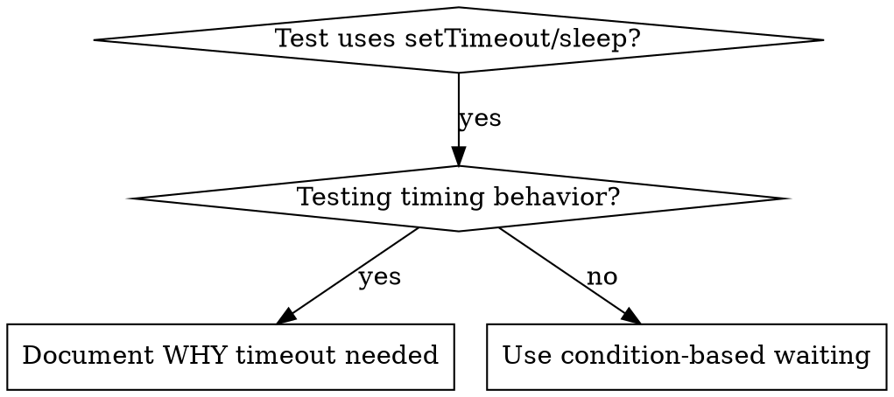

# 條件式等待（Condition-Based Waiting）

## 概觀

flaky 測試常用任意的延遲來猜測 timing。這會製造 race condition：測試在快的機器上通過，但在高負載或 CI 下失敗。

**核心原則：**等待你真正在意的那個條件，而不是猜它要花多久。

## 何時使用



**在以下情況使用：**
- 測試有任意延遲（`setTimeout`、`sleep`、`time.sleep()`）
- 測試 flaky（有時通過，高負載下失敗）
- 測試在平行執行時 timeout
- 等待非同步操作完成

**不要在以下情況使用：**
- 測試的正是 timing 行為（debounce、throttle 間隔）
- 若使用任意 timeout，一律記錄「為什麼」

## 核心模式

```typescript
// ❌ BEFORE: Guessing at timing
await new Promise(r => setTimeout(r, 50));
const result = getResult();
expect(result).toBeDefined();

// ✅ AFTER: Waiting for condition
await waitFor(() => getResult() !== undefined);
const result = getResult();
expect(result).toBeDefined();
```

## 快速模式

| 情境 | 模式 |
|----------|---------|
| 等事件 | `waitFor(() => events.find(e => e.type === 'DONE'))` |
| 等狀態 | `waitFor(() => machine.state === 'ready')` |
| 等數量 | `waitFor(() => items.length >= 5)` |
| 等檔案 | `waitFor(() => fs.existsSync(path))` |
| 複合條件 | `waitFor(() => obj.ready && obj.value > 10)` |

## 實作

通用輪詢函式：
```typescript
async function waitFor<T>(
  condition: () => T | undefined | null | false,
  description: string,
  timeoutMs = 5000
): Promise<T> {
  const startTime = Date.now();

  while (true) {
    const result = condition();
    if (result) return result;

    if (Date.now() - startTime > timeoutMs) {
      throw new Error(`Timeout waiting for ${description} after ${timeoutMs}ms`);
    }

    await new Promise(r => setTimeout(r, 10)); // Poll every 10ms
  }
}
```

本目錄的 `condition-based-waiting-example.ts` 有完整實作，含來自實際除錯 session 的領域專用 helper（`waitForEvent`、`waitForEventCount`、`waitForEventMatch`）。

## 常見錯誤

**❌ 輪詢太快：**`setTimeout(check, 1)` - 浪費 CPU
**✅ 修正：**每 10ms 輪詢一次

**❌ 沒有 timeout：**若條件永遠不成立就無限迴圈
**✅ 修正：**一律加上 timeout，並附清楚的錯誤

**❌ 過時的資料：**在迴圈前就把狀態 cache 起來
**✅ 修正：**在迴圈內呼叫 getter 以取得最新資料

## 任意 Timeout 正確的時機

```typescript
// Tool ticks every 100ms - need 2 ticks to verify partial output
await waitForEvent(manager, 'TOOL_STARTED'); // First: wait for condition
await new Promise(r => setTimeout(r, 200));   // Then: wait for timed behavior
// 200ms = 2 ticks at 100ms intervals - documented and justified
```

**要求：**
1. 先等待觸發的條件
2. 基於已知的 timing（不是用猜的）
3. 附上解釋「為什麼」的註解

## 真實世界的影響

來自一次除錯 session（2025-10-03）:
- 修好 3 個檔案裡的 15 個 flaky 測試
- 通過率：60% → 100%
- 執行時間：快了 40%
- 不再有 race condition
