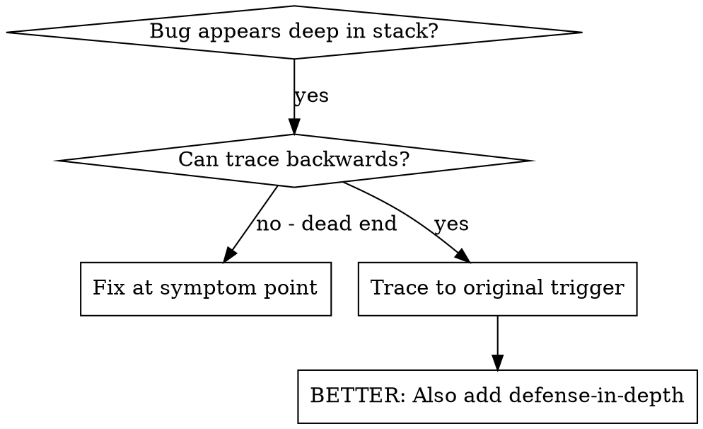
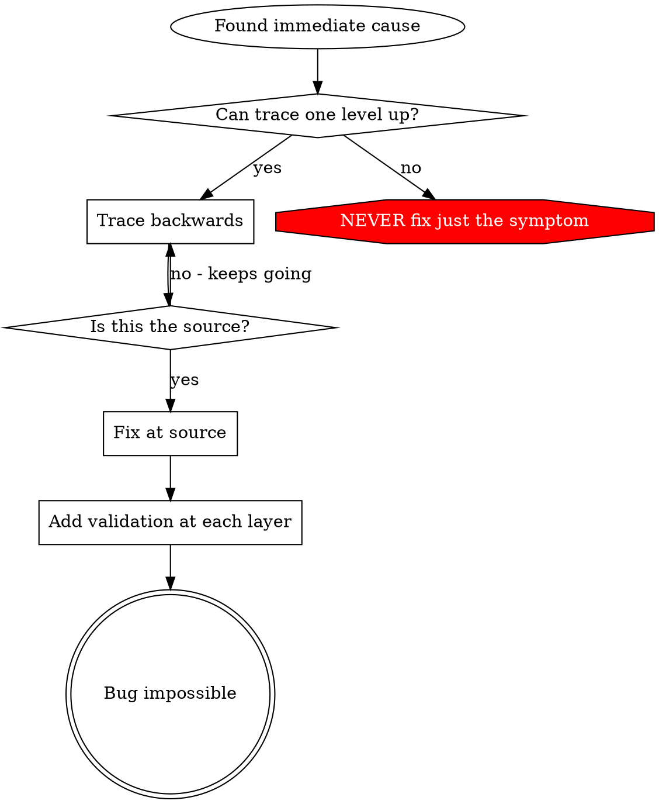

# 根本原因追蹤（Root Cause Tracing）

## 概觀

Bug 常常顯現在 call stack 的深處（git init 在錯誤的目錄、檔案建在錯誤的位置、資料庫用錯誤的路徑開啟）。你的直覺是在錯誤出現的地方修，但那是在治標。

**核心原則：**沿著呼叫鏈反向追蹤，直到找到最初的觸發點，然後在源頭修正。

## 何時使用



**在以下情況使用：**
- 錯誤發生在執行深處（不是在進入點）
- Stack trace 顯示很長的呼叫鏈
- 不清楚無效資料從何而來
- 需要找出是哪個測試／程式碼觸發了問題

## 追蹤流程

### 1. 觀察症狀
```
Error: git init failed in ~/project/packages/core
```

### 2. 找出直接原因
**什麼程式碼直接造成這個？**
```typescript
await execFileAsync('git', ['init'], { cwd: projectDir });
```

### 3. 追問：是什麼呼叫了它？
```typescript
WorktreeManager.createSessionWorktree(projectDir, sessionId)
  → called by Session.initializeWorkspace()
  → called by Session.create()
  → called by test at Project.create()
```

### 4. 持續往上追
**傳進去的是什麼值？**
- `projectDir = ''`（空字串！）
- 空字串當作 `cwd` 會解析成 `process.cwd()`
- 那就是原始碼目錄！

### 5. 找出最初的觸發點
**空字串是從哪裡來的？**
```typescript
const context = setupCoreTest(); // Returns { tempDir: '' }
Project.create('name', context.tempDir); // Accessed before beforeEach!
```

## 加上 Stack Trace

當你無法手動追蹤時，加上 instrumentation:

```typescript
// Before the problematic operation
async function gitInit(directory: string) {
  const stack = new Error().stack;
  console.error('DEBUG git init:', {
    directory,
    cwd: process.cwd(),
    nodeEnv: process.env.NODE_ENV,
    stack,
  });

  await execFileAsync('git', ['init'], { cwd: directory });
}
```

**關鍵：**在測試中用 `console.error()`（不要用 logger——可能不會顯示）

**執行並擷取：**
```bash
npm test 2>&1 | grep 'DEBUG git init'
```

**分析 stack trace：**
- 找測試檔名
- 找出觸發呼叫的行號
- 辨識模式（同一個測試？同一個參數？）

## 找出是哪個測試造成污染

若某個東西在測試期間出現，但你不知道是哪個測試：

使用本目錄的二分搜尋腳本 `find-polluter.sh`:

```bash
./find-polluter.sh '.git' 'src/**/*.test.ts'
```

逐一執行測試，在第一個污染者處停下。用法見腳本。

## 實際範例：空的 projectDir

**症狀：**`.git` 被建在 `packages/core/`（原始碼）

**追蹤鏈：**
1. `git init` 在 `process.cwd()` 執行 ← 空的 cwd 參數
2. WorktreeManager 以空的 projectDir 被呼叫
3. Session.create() 傳入空字串
4. 測試在 beforeEach 之前存取了 `context.tempDir`
5. setupCoreTest() 一開始回傳 `{ tempDir: '' }`

**根本原因：**頂層變數初始化時存取了空值

**修正：**把 tempDir 改成一個 getter，若在 beforeEach 之前被存取就丟錯

**同時加上 defense-in-depth：**
- Layer 1：Project.create() 驗證目錄
- Layer 2：WorkspaceManager 驗證不為空
- Layer 3：NODE_ENV guard 拒絕在 tmpdir 之外執行 git init
- Layer 4：git init 之前記錄 stack trace

## 關鍵原則



**絕對不要（NEVER）只修錯誤出現的地方。**往回追蹤，找到最初的觸發點。

## Stack Trace 小技巧

**在測試中：**用 `console.error()` 而非 logger——logger 可能被抑制
**在操作之前：**在危險操作之前記錄，而不是等它失敗之後
**納入 context：**目錄、cwd、環境變數、時間戳
**擷取 stack：**`new Error().stack` 顯示完整的呼叫鏈

## 真實世界的影響

來自一次除錯 session（2025-10-03）:
- 透過 5 層追蹤找到根本原因
- 在源頭修正（getter 驗證）
- 加上 4 層防禦
- 1847 個測試通過，零污染
