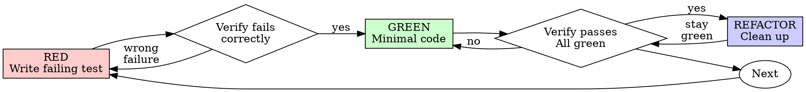

# 測試驅動開發（Test-Driven Development, TDD）

## 概觀

先寫測試。看著它失敗。再寫最小程式碼讓它通過。

**核心原則：**如果你沒有親眼看著測試失敗，你就不知道它測的是不是對的東西。

**違反規則的字面，就是違反規則的精神。**

## 何時使用

**一律（Always）：**
- 新功能
- 修 bug
- 重構（refactor）
- 行為變更

**例外（先詢問你合作的人類使用者）：**
- 用完即丟的原型
- 產生器產出的程式碼
- 設定檔

心想「就這麼一次跳過 TDD」？停。那是合理化藉口。

## 鐵律（The Iron Law）

```
沒有先寫一個會失敗的測試，就不得寫任何正式程式碼
NO PRODUCTION CODE WITHOUT A FAILING TEST FIRST
```

在測試之前就寫了程式碼？刪掉它。重新開始。

**沒有例外：**
- 不要把它留著當「參考」
- 不要在寫測試時「順手改用」它
- 不要看它
- 刪除就是刪除

從測試重新實作。不容討論。

## Red-Green-Refactor



### RED——撰寫會失敗的測試

寫一個最小的測試，表達應該發生什麼。

<Good>
```typescript
test('retries failed operations 3 times', async () => {
  let attempts = 0;
  const operation = () => {
    attempts++;
    if (attempts < 3) throw new Error('fail');
    return 'success';
  };

  const result = await retryOperation(operation);

  expect(result).toBe('success');
  expect(attempts).toBe(3);
});
```
名稱清楚、測真實行為、只測一件事
</Good>

<Bad>
```typescript
test('retry works', async () => {
  const mock = jest.fn()
    .mockRejectedValueOnce(new Error())
    .mockRejectedValueOnce(new Error())
    .mockResolvedValueOnce('success');
  await retryOperation(mock);
  expect(mock).toHaveBeenCalledTimes(3);
});
```
名稱含糊、測的是 mock 而非程式碼
</Bad>

**要求：**
- 一個行為
- 名稱清楚
- 真實程式碼（除非不得已，否則不用 mock）

### 驗證 RED——看著它失敗

**強制，絕對不要（Never）略過。**

```bash
npm test path/to/test.test.ts
```

確認：
- 測試 fail（不是 error）
- 失敗訊息符合預期
- 失敗是因為功能還沒做（不是打錯字）

**測試通過了？**你測的是既有行為。修正測試。

**測試 error？**修正 error，重跑到它正確地失敗為止。

### GREEN——最小程式碼

寫最簡單、能讓測試通過的程式碼。

<Good>
```typescript
async function retryOperation<T>(fn: () => Promise<T>): Promise<T> {
  for (let i = 0; i < 3; i++) {
    try {
      return await fn();
    } catch (e) {
      if (i === 2) throw e;
    }
  }
  throw new Error('unreachable');
}
```
剛好夠讓測試通過
</Good>

<Bad>
```typescript
async function retryOperation<T>(
  fn: () => Promise<T>,
  options?: {
    maxRetries?: number;
    backoff?: 'linear' | 'exponential';
    onRetry?: (attempt: number) => void;
  }
): Promise<T> {
  // YAGNI
}
```
過度設計
</Bad>

不要加功能、不要重構其他程式碼，也不要做超出測試需要的「改進」。

### 驗證 GREEN——看著它通過

**強制。**

```bash
npm test path/to/test.test.ts
```

確認：
- 測試通過
- 其他測試仍然通過
- 輸出乾淨（沒有 error、warning）

**測試 fail？**修正程式碼，不是測試。

**其他測試 fail？**現在就修。

### REFACTOR——整理

只在 green 之後：
- 移除重複
- 改善命名
- 抽出 helper

保持測試 green。不要加行為。

### 重複

為下一個功能寫下一個會失敗的測試。

## 好的測試

| 特質 | 好 | 壞 |
|---------|------|-----|
| **最小** | 只測一件事。名稱裡有「and」？拆開它。 | `test('validates email and domain and whitespace')` |
| **清楚** | 名稱描述行為 | `test('test1')` |
| **展現意圖** | 展示期望的 API | 遮蔽了程式碼應該做什麼 |

## 為何順序重要

**「我等實作完再寫測試來驗證它能動」**

在程式碼之後寫的測試會立刻通過。立刻通過什麼都證明不了：
- 可能測錯東西
- 可能測的是實作，而非行為
- 可能漏掉你忘記的邊界情況
- 你從沒看過它抓到 bug

測試先行強迫你看著測試失敗，證明它真的在測某個東西。

**「我已經手動測過所有邊界情況了」**

手動測試是臨時拼湊的。你以為都測了，但是：
- 沒有紀錄測了什麼
- 程式碼改動時無法重跑
- 壓力下很容易忘記某些情況
- 「我試的時候能動」≠ 全面

自動化測試是系統化的。每次都以相同方式執行。

**「刪掉 X 小時的成果太浪費了」**

沉沒成本謬誤。那些時間已經花掉了。你現在的選擇是：
- 刪掉並用 TDD 重寫（再花 X 小時，高信心）
- 留著並事後補測試（30 分鐘，低信心，很可能有 bug）

真正的「浪費」是留著你無法信任的程式碼。沒有真正測試的可運作程式碼，是技術債。

**「TDD 太教條，務實就是要懂得變通」**

TDD 本來就務實：
- 在 commit 前找到 bug（比事後除錯快）
- 防止 regression（測試立刻抓到破壞）
- 記錄行為（測試展示如何使用程式碼）
- 讓重構成為可能（自由更動，測試會抓到破壞）

「務實」的捷徑 = 在正式環境除錯 = 更慢。

**「事後測試也能達成相同目標——重點是精神不是儀式」**

不對。事後測試回答「這在做什麼？」;測試先行回答「這應該做什麼？」

事後測試會被你的實作偏誤帶著走。你測的是你做出來的東西，不是需求所要求的。你驗證的是記得的邊界情況，不是被發掘出來的。

測試先行強迫你在實作前發掘邊界情況。事後測試只是驗證你把一切都記住了（你沒有）。

事後補 30 分鐘測試 ≠ TDD。你拿到覆蓋率，卻失去了「測試有效」的證明。

## 常見合理化藉口

| 藉口 | 事實 |
|--------|---------|
| 「太簡單，不用測」 | 簡單的程式碼也會壞。測試只花 30 秒。 |
| 「我事後再測」 | 立刻通過的測試什麼都證明不了。 |
| 「事後測試也能達成相同目標」 | 事後測試 =「這在做什麼？」測試先行 =「這應該做什麼？」 |
| 「我已經手動測過了」 | 臨時拼湊 ≠ 系統化。沒有紀錄，無法重跑。 |
| 「刪掉 X 小時太浪費」 | 沉沒成本謬誤。留著未驗證的程式碼是技術債。 |
| 「留著當參考，先寫測試」 | 你會順手改用它。那就是事後測試。刪除就是刪除。 |
| 「我得先探索一下」 | 可以。丟掉探索的成果，再用 TDD 從頭開始。 |
| 「難以測試 = 設計不清」 | 聽測試的話。難測 = 難用。 |
| 「TDD 會拖慢我」 | TDD 比除錯快。務實 = 測試先行。 |
| 「手動測比較快」 | 手動測證明不了邊界情況。你每次改動都得重測。 |
| 「既有程式碼沒有測試」 | 你正在改善它。為既有程式碼補上測試。 |

## 警訊（Red Flags）——停下並重新開始

- 程式碼寫在測試之前
- 在實作之後才寫測試
- 測試立刻通過
- 說不出測試為什麼失敗
- 測試「之後再」補
- 合理化「就這麼一次」
- 「我已經手動測過了」
- 「事後測試也能達成相同目的」
- 「重點是精神不是儀式」
- 「留著當參考」或「順手改用既有程式碼」
- 「已經花了 X 小時，刪掉太浪費」
- 「TDD 太教條，我是在務實」
- 「這次不一樣，因為……」

**以上全部都代表：刪除程式碼。用 TDD 從頭開始。**

## 範例：修 Bug

**Bug：**空 email 被接受

**RED**
```typescript
test('rejects empty email', async () => {
  const result = await submitForm({ email: '' });
  expect(result.error).toBe('Email required');
});
```

**驗證 RED**
```bash
$ npm test
FAIL: expected 'Email required', got undefined
```

**GREEN**
```typescript
function submitForm(data: FormData) {
  if (!data.email?.trim()) {
    return { error: 'Email required' };
  }
  // ...
}
```

**驗證 GREEN**
```bash
$ npm test
PASS
```

**REFACTOR**
需要的話，把驗證邏輯抽出來給多個欄位共用。

## 驗證 Checklist

在把工作標記為完成之前：

- [ ] 每個新的 function／method 都有測試
- [ ] 在實作前看過每個測試失敗
- [ ] 每個測試都因預期的原因失敗（功能還沒做，不是打錯字）
- [ ] 為每個測試寫了最小程式碼讓它通過
- [ ] 所有測試都通過
- [ ] 輸出乾淨（沒有 error、warning）
- [ ] 測試使用真實程式碼（除非不得已才用 mock）
- [ ] 邊界情況與錯誤都有涵蓋

無法勾選全部？你跳過了 TDD。重新開始。

## 卡住時

| 問題 | 解法 |
|---------|----------|
| 不知道怎麼測 | 寫出你希望有的 API。先寫 assertion。問你合作的人類使用者。 |
| 測試太複雜 | 設計太複雜。簡化介面。 |
| 什麼都得 mock | 程式碼耦合太緊。用 dependency injection。 |
| 測試 setup 很龐大 | 抽出 helper。還是很複雜？簡化設計。 |

## 與除錯整合

發現 bug？寫一個會失敗、能重現它的測試。走 TDD 週期。測試同時證明修好了，也防止 regression。

絕對不要（Never）在沒有測試的情況下修 bug。

## 測試反模式

在加入 mock 或測試工具時，閱讀 [testing-anti-patterns.md](testing-anti-patterns.md) 以避免常見陷阱：
- 測的是 mock 的行為，而非真實行為
- 在正式類別中加入只給測試用的 method
- 在不了解相依關係的情況下 mock

## 最終規則

```
正式程式碼 → 測試存在且先失敗過
否則 → 不是 TDD
Production code → test exists and failed first
Otherwise → not TDD
```

未取得你合作的人類使用者許可，沒有例外。
