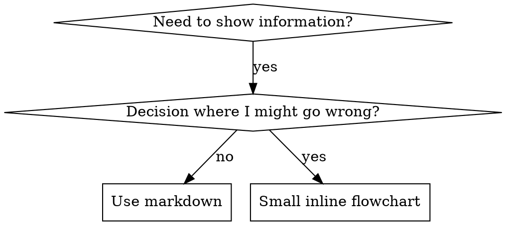

# Writing Skills

## 概觀

**寫 skill 就是把測試驅動開發（Test-Driven Development）套用在流程文件上。**

**個人 skill 放在你 runtime 的 skills 目錄裡**

你寫測試案例（用 subagent 跑壓力情境）、看著它們失敗（baseline 行為）、寫 skill（文件）、看著測試通過（agent 遵循）、再重構（堵住漏洞）。

**核心原則：**如果你沒有親眼看過 agent 在「沒有這個 skill」時失敗,你就不知道這個 skill 教的是不是對的東西。

**必要背景（REQUIRED BACKGROUND）：**使用這個 skill 之前,你必須（MUST）先理解 superpowers:test-driven-development。那個 skill 定義了根本的 RED-GREEN-REFACTOR 週期。這個 skill 把 TDD 改編到文件上。

**官方指引：**Anthropic 官方的 skill 撰寫最佳實務,見 anthropic-best-practices.md。該文件提供額外的模式與準則,與本 skill 以 TDD 為核心的取向互補。

## 什麼是 Skill？

**skill** 是一份針對「已驗證的技巧、模式或工具」的參考指南。skill 幫助未來的 agent 找到並套用有效的做法。

**skill 是：**可重複使用的技巧、模式、工具、參考指南

**skill 不是（NOT）：**關於你某一次如何解決某問題的敘事

## Skill 的 TDD 對應

| TDD 概念 | Skill 建立 |
|-------------|----------------|
| **測試案例** | 用 subagent 的壓力情境 |
| **正式程式碼** | Skill 文件（SKILL.md） |
| **測試失敗（RED）** | agent 在沒有 skill 時違反規則（baseline） |
| **測試通過（GREEN）** | agent 在有 skill 時遵循 |
| **重構（Refactor）** | 在維持遵循的前提下堵住漏洞 |
| **測試先行** | 在寫 skill 之前先跑 baseline 情境 |
| **看著它失敗** | 記錄 agent 使用的確切合理化藉口 |
| **最小程式碼** | 寫出針對那些特定違規的 skill |
| **看著它通過** | 驗證 agent 現在遵循了 |
| **重構週期** | 找到新的合理化藉口 → 堵住 → 重新驗證 |

整個 skill 建立流程都遵循 RED-GREEN-REFACTOR。

## 何時建立 Skill

**在以下情況建立：**
- 這個技巧對你來說不是直覺上顯而易見的
- 你會在不同專案間再次參考它
- 這個模式適用範圍廣（不是特定專案專屬）
- 別人也會受益

**不要為以下情況建立：**
- 一次性的解法
- 別處已有完整記錄的標準做法
- 特定專案的慣例（放進你的 instructions 檔）
- 機械式的約束（如果能用 regex／驗證強制執行,就自動化它——把文件留給需要判斷的情況）

## Skill 類型

### Technique（技巧）
有步驟可循的具體方法（condition-based-waiting、root-cause-tracing）

### Pattern（模式）
思考問題的方式（flatten-with-flags、test-invariants）

### Reference（參考）
API 文件、語法指南、工具文件（office docs）

## 目錄結構


```
skills/
  skill-name/
    SKILL.md              # Main reference (required)
    supporting-file.*     # Only if needed
```

**扁平命名空間（Flat namespace）**——所有 skill 都在同一個可搜尋的命名空間裡

**下列情況另開檔案：**
1. **大型參考**（100+ 行）——API 文件、完整語法
2. **可重用工具**——腳本、公用程式、模板

**保持 inline：**
- 原則與概念
- 程式碼模式（< 50 行）
- 其他一切

## SKILL.md 結構

**Frontmatter（YAML）：**
- 兩個必填欄位:`name` 與 `description`（所有支援的欄位見 [agentskills.io/specification](https://agentskills.io/specification)）
- 全部最多 1024 個字元
- `name`:只用字母、數字與連字號（不要括號、特殊字元）
- `description`:第三人稱,只（ONLY）描述「何時使用」（不是它做什麼）
  - 以「Use when...」開頭,聚焦於觸發條件
  - 納入具體的症狀、情境與脈絡
  - **絕對不要（NEVER）摘要 skill 的流程或工作流程**（原因見 SDO 一節）
  - 可以的話控制在 500 字元以內

```markdown
---
name: Skill-Name-With-Hyphens
description: Use when [specific triggering conditions and symptoms]
---

# Skill Name

## Overview
What is this? Core principle in 1-2 sentences.

## When to Use
[Small inline flowchart IF decision non-obvious]

Bullet list with SYMPTOMS and use cases
When NOT to use

## Core Pattern (for techniques/patterns)
Before/after code comparison

## Quick Reference
Table or bullets for scanning common operations

## Implementation
Inline code for simple patterns
Link to file for heavy reference or reusable tools

## Common Mistakes
What goes wrong + fixes

## Real-World Impact (optional)
Concrete results
```


## Skill 探索最佳化（Skill Discovery Optimization, SDO）

**對探索至關重要：**未來的 agent 需要「找到」你的 skill

### 1. 豐富的 Description 欄位

**目的：**你的 agent 讀 description 來決定某個任務要載入哪些 skill。讓它能回答:「我現在該不該讀這個 skill？」

**格式：**以「Use when...」開頭,聚焦於觸發條件

**關鍵（CRITICAL）:Description ＝ 何時使用,而非 skill 做什麼**

description 應該只（ONLY）描述觸發條件。不要（Do NOT）在 description 裡摘要 skill 的流程或工作流程。

**為何重要：**測試顯示,當 description 摘要了 skill 的工作流程,agent 可能會照著 description 做,而不去讀完整的 skill 內容。一個寫著「任務之間做 code review」的 description,導致某 agent 只做了「一次」review,即使 skill 的流程圖清楚顯示要做「兩次」（先規格符合、再程式碼品質）。

當 description 改成只寫「Use when executing implementation plans with independent tasks」（沒有工作流程摘要）時,agent 就正確地讀了流程圖,並遵循兩階段的 review 流程。

**陷阱：**摘要工作流程的 description 會製造一條 agent 會走的捷徑。skill 本體就變成 agent 略過的文件。

```yaml
# ❌ BAD: Summarizes workflow - agents may follow this instead of reading skill
description: Use when executing plans - dispatches subagent per task with code review between tasks

# ❌ BAD: Too much process detail
description: Use for TDD - write test first, watch it fail, write minimal code, refactor

# ✅ GOOD: Just triggering conditions, no workflow summary
description: Use when executing implementation plans with independent tasks in the current session

# ✅ GOOD: Triggering conditions only
description: Use when implementing any feature or bugfix, before writing implementation code
```

**內容：**
- 用具體的觸發點、症狀與情境,標示這個 skill 何時適用
- 描述「問題」（race condition、行為不一致）而非「特定語言的症狀」（setTimeout、sleep）
- 讓觸發點與技術無關,除非 skill 本身就是特定技術專屬
- 若 skill 是特定技術專屬,就在觸發點裡明講
- 以第三人稱書寫（會被注入 system prompt）
- **絕對不要（NEVER）摘要 skill 的流程或工作流程**

```yaml
# ❌ BAD: Too abstract, vague, doesn't include when to use
description: For async testing

# ❌ BAD: First person
description: I can help you with async tests when they're flaky

# ❌ BAD: Mentions technology but skill isn't specific to it
description: Use when tests use setTimeout/sleep and are flaky

# ✅ GOOD: Starts with "Use when", describes problem, no workflow
description: Use when tests have race conditions, timing dependencies, or pass/fail inconsistently

# ✅ GOOD: Technology-specific skill with explicit trigger
description: Use when using React Router and handling authentication redirects
```

### 2. 關鍵字涵蓋

用 agent 會拿去搜尋的字：
- 錯誤訊息:「Hook timed out」、「ENOTEMPTY」、「race condition」
- 症狀:「flaky」、「hanging」、「zombie」、「pollution」
- 同義詞:「timeout/hang/freeze」、「cleanup/teardown/afterEach」
- 工具:實際的指令、函式庫名稱、檔案類型

### 3. 具描述性的命名

**用主動語態、動詞開頭：**
- ✅ `creating-skills`,不是 `skill-creation`
- ✅ `condition-based-waiting`,不是 `async-test-helpers`

### 4. Token 效率（關鍵）

**問題：**getting-started 與經常被引用的 skill 會載入「每一個」對話。每個 token 都重要。

**目標字數：**
- getting-started 工作流程:各 <150 字
- 經常載入的 skill:總共 <200 字
- 其他 skill:<500 字（仍要精簡）

**技巧：**

**把細節移到工具的 help：**
```bash
# ❌ BAD: Document all flags in SKILL.md
search-conversations supports --text, --both, --after DATE, --before DATE, --limit N

# ✅ GOOD: Reference --help
search-conversations supports multiple modes and filters. Run --help for details.
```

**使用交叉引用：**
```markdown
# ❌ BAD: Repeat workflow details
When searching, dispatch subagent with template...
[20 lines of repeated instructions]

# ✅ GOOD: Reference other skill
Always use subagents (50-100x context savings). REQUIRED: Use [other-skill-name] for workflow.
```

**壓縮範例：**
```markdown
# ❌ BAD: Verbose example (42 words)
your human partner: "How did we handle authentication errors in React Router before?"
You: I'll search past conversations for React Router authentication patterns.
[Dispatch subagent with search query: "React Router authentication error handling 401"]

# ✅ GOOD: Minimal example (20 words)
Partner: "How did we handle auth errors in React Router?"
You: Searching...
[Dispatch subagent → synthesis]
```

**消除冗餘：**
- 不要重複交叉引用的 skill 裡已有的內容
- 不要解釋從指令就顯而易見的事
- 不要放同一個模式的多個範例

**驗證：**
```bash
wc -w skills/path/SKILL.md
# getting-started workflows: aim for <150 each
# Other frequently-loaded: aim for <200 total
```

**用「你做什麼」或核心洞見來命名：**
- ✅ `condition-based-waiting` > `async-test-helpers`
- ✅ `using-skills`,不是 `skill-usage`
- ✅ `flatten-with-flags` > `data-structure-refactoring`
- ✅ `root-cause-tracing` > `debugging-techniques`

**動名詞（-ing）很適合流程：**
- `creating-skills`、`testing-skills`、`debugging-with-logs`
- 主動、描述你正在採取的動作

### 5. 交叉引用其他 Skill

**當你寫的文件會引用其他 skill 時：**

只用 skill 名稱,並加上明確的必要性標記：
- ✅ 好:`**REQUIRED SUB-SKILL:** Use superpowers:test-driven-development`
- ✅ 好:`**REQUIRED BACKGROUND:** You MUST understand superpowers:systematic-debugging`
- ❌ 壞:`See skills/testing/test-driven-development`（不清楚是否必要）
- ❌ 壞:`@skills/testing/test-driven-development/SKILL.md`（強制載入,燒 context）

**為何不用 @ 連結：**`@` 語法會立刻強制載入檔案,在你需要它之前就吃掉 200k+ 的 context。

## 流程圖的使用



**只（ONLY）在以下情況使用流程圖：**
- 不顯而易見的決策點
- 你可能太早停下的流程迴圈
- 「何時用 A 對 B」的決策

**絕對不要（Never）在以下情況使用流程圖：**
- 參考材料 → 表格、清單
- 程式碼範例 → markdown 區塊
- 線性指令 → 編號清單
- 沒有語意的標籤（step1、helper2）

graphviz 樣式規則見本目錄的 `graphviz-conventions.dot`。

**為你合作的人類使用者呈現視覺化：**用本目錄的 `render-graphs.js` 把某 skill 的流程圖 render 成 SVG：
```bash
./render-graphs.js ../some-skill           # Each diagram separately
./render-graphs.js ../some-skill --combine # All diagrams in one SVG
```

## 程式碼範例

**一個絕佳的範例勝過許多平庸的範例**

選最相關的語言：
- 測試技巧 → TypeScript/JavaScript
- 系統除錯 → Shell/Python
- 資料處理 → Python

**好的範例：**
- 完整且可執行
- 有良好註解、解釋「為什麼」
- 來自真實情境
- 清楚展示模式
- 可直接改用（不是通用模板）

**不要：**
- 用 5 種以上語言實作
- 建立填空式模板
- 寫造作的範例

你很擅長移植——一個很棒的範例就夠了。

## 檔案組織

### 自足的 Skill
```
defense-in-depth/
  SKILL.md    # Everything inline
```
時機:所有內容都放得下,不需要大型參考

### 帶可重用工具的 Skill
```
condition-based-waiting/
  SKILL.md    # Overview + patterns
  example.ts  # Working helpers to adapt
```
時機:工具是可重用的程式碼,而非只是敘事

### 帶大型參考的 Skill
```
pptx/
  SKILL.md       # Overview + workflows
  pptxgenjs.md   # 600 lines API reference
  ooxml.md       # 500 lines XML structure
  scripts/       # Executable tools
```
時機:參考材料太大,無法 inline

## 鐵律（與 TDD 相同）

```
沒有先寫一個會失敗的測試，就不得寫任何 skill
NO SKILL WITHOUT A FAILING TEST FIRST
```

這適用於「新 skill」與「對既有 skill 的編輯」。

在測試之前就寫了 skill？刪掉它。重新開始。
沒測試就編輯 skill？同樣是違規。

**沒有例外：**
- 不因「只是小增補」而例外
- 不因「只是加一個段落」而例外
- 不因「只是更新文件」而例外
- 不要把未測試的變更留著當「參考」
- 不要在跑測試時「順手改用」它
- 刪除就是刪除

**必要背景（REQUIRED BACKGROUND）：**superpowers:test-driven-development skill 解釋了為何這很重要。相同的原則適用於文件。

## 測試所有 Skill 類型

不同的 skill 類型需要不同的測試取向：

### 紀律強制型 Skill（規則／要求）

**範例：**TDD、verification-before-completion、designing-before-coding

**測試方式：**
- 學術性問題:他們理解規則嗎？
- 壓力情境:他們在壓力下遵循嗎？
- 多重壓力併發:時間 + 沉沒成本 + 疲勞
- 辨識合理化藉口,並加上明確的反制

**成功標準：**agent 在最大壓力下仍遵循規則

### 技巧型 Skill（how-to 指南）

**範例：**condition-based-waiting、root-cause-tracing、defensive-programming

**測試方式：**
- 應用情境:他們能正確套用這個技巧嗎？
- 變化情境:他們能處理邊界情況嗎？
- 缺資訊測試:指令有沒有缺口？

**成功標準：**agent 成功把技巧套用到新情境

### 模式型 Skill（心智模型）

**範例：**reducing-complexity、information-hiding 概念

**測試方式：**
- 辨識情境:他們認得出模式何時適用嗎？
- 應用情境:他們能使用這個心智模型嗎？
- 反例:他們知道何時「不」該套用嗎？

**成功標準：**agent 正確辨識何時／如何套用模式

### 參考型 Skill（文件／API）

**範例：**API 文件、指令參考、函式庫指南

**測試方式：**
- 檢索情境:他們能找到正確的資訊嗎？
- 應用情境:他們能正確使用找到的東西嗎？
- 缺口測試:常見用例都涵蓋了嗎？

**成功標準：**agent 找到並正確套用參考資訊

## 略過測試的常見合理化藉口

| 藉口 | 事實 |
|--------|---------|
| 「skill 顯然很清楚」 | 對你清楚 ≠ 對其他 agent 清楚。測它。 |
| 「這只是參考」 | 參考也會有缺口、不清楚的段落。測檢索。 |
| 「測試太over了」 | 未測試的 skill 一定有問題。15 分鐘測試省下數小時。 |
| 「有問題再測」 | 有問題 = agent 無法使用 skill。部署「之前」就測。 |
| 「測試太繁瑣」 | 測試比在正式環境除錯壞 skill 還不繁瑣。 |
| 「我有信心它很好」 | 過度自信保證出問題。還是要測。 |
| 「學術性檢視就夠了」 | 讀 ≠ 用。測應用情境。 |
| 「沒時間測」 | 部署未測試的 skill,之後修它更浪費時間。 |

**以上全部都代表:部署前先測。沒有例外。**

## 讓形式對應失敗（Match the Form to the Failure）

在寫指引之前,先把 baseline 失敗分類。能為某一種失敗類型「防彈化」的形式,對另一種類型會明顯適得其反。

| Baseline 失敗 | 對的形式 | 錯的形式 |
|---|---|---|
| 在壓力下略過／違反規則（明知卻照做） | 禁止 + 合理化表 + 警訊（見下方 Bulletproofing） | 軟性指引（「盡量…」、「考慮…」） |
| 有遵循,但輸出形狀錯了（prompt 臃腫、verdict 被埋、重述 spec） | 正面食譜或契約:陳述輸出「是」什麼——它的組成部分,依序 | 禁止清單（「不要重述」、「絕不敘述」） |
| 從他們已經產出的東西裡漏掉某個必要元素 | 結構性:在他們要填的模板裡放一個 REQUIRED 欄位或槽位 | 模板附近的散文提醒 |
| 行為應該取決於某個條件 | 以可觀察的謂詞為鍵的條件式（「若 brief 存在,就引用它」） | 無條件規則 + 例外條款 |

**為何禁止對「塑形問題」適得其反：**在有競爭誘因（「讓 prompt 自足」）時,agent 會跟「don't X」討價還價。在針對 dispatch-prompt 指引的一對一措辭測試中,禁止那組產生的不想要內容明顯「更多」（分佈完全分離）,而且趨勢比連「無指引」對照組還差——micro-test 你自己的案例,別用假設,但也絕不預設就伸手去拿禁止。食譜讓人無從討價還價:輸出要嘛符合陳述的形狀,要嘛不符合。

**不論你選哪種形式的通則：**
- **不要有 nuance 條款。**「Don't X unless it matters」會重新開啟討價還價——在同一組措辭測試中,對一個勝出的食譜附加單一 nuance 條款,就把它從「一致」劣化成「雜亂」。要表達真正的例外,就把它寫成一個以可觀察謂詞為鍵的獨立條件式。
- **例外條款無法限定範圍。**「這個限制不適用於 code block」仍然會壓抑 code block。若輸出的某部分必須豁免,就重構結構,讓規則構不到它。

## 讓 Skill 對抗合理化而防彈

強制紀律的 skill（如 TDD）需要抵抗合理化。agent 很聰明,在壓力下會找漏洞。

**範圍：**這套工具是給「紀律失敗」用的——一個明知規則卻在壓力下略過的 agent。對於「輸出形狀錯」或「漏掉元素」,以禁止為基礎的防彈化會適得其反;改用「讓形式對應失敗」裡的形式。

**心理學備註：**理解「為什麼」說服技巧有效,能幫你有系統地運用它們。研究基礎（Cialdini, 2021; Meincke et al., 2025）關於權威、承諾、稀缺、社會證明與一體性原則,見 persuasion-principles.md。

### 明確堵住每一個漏洞

不要只陳述規則——要禁止特定的變通做法：

<Bad>
```markdown
Write code before test? Delete it.
```
</Bad>

<Good>
```markdown
Write code before test? Delete it. Start over.

**No exceptions:**
- Don't keep it as "reference"
- Don't "adapt" it while writing tests
- Don't look at it
- Delete means delete
```
</Good>

### 處理「精神 vs 字面」的爭論

及早加入基礎原則：

```markdown
**Violating the letter of the rules is violating the spirit of the rules.**
```

這能切斷一整類「我是在遵循精神」的合理化。

### 建立合理化表

從 baseline 測試蒐集合理化藉口（見下方測試一節）。agent 講的每一個藉口都進表：

```markdown
| Excuse | Reality |
|--------|---------|
| "Too simple to test" | Simple code breaks. Test takes 30 seconds. |
| "I'll test after" | Tests passing immediately prove nothing. |
| "Tests after achieve same goals" | Tests-after = "what does this do?" Tests-first = "what should this do?" |
```

### 建立警訊清單

讓 agent 在合理化時容易自我檢查：

```markdown
## Red Flags - STOP and Start Over

- Code before test
- "I already manually tested it"
- "Tests after achieve the same purpose"
- "It's about spirit not ritual"
- "This is different because..."

**All of these mean: Delete code. Start over with TDD.**
```

### 為違規症狀更新 SDO

在 description 裡加上:你「即將」違反規則時的症狀：

```yaml
description: use when implementing any feature or bugfix, before writing implementation code
```

## Skill 的 RED-GREEN-REFACTOR

遵循 TDD 週期：

### RED：寫會失敗的測試（Baseline）

用 subagent 在「沒有 skill」時跑壓力情境。記錄確切行為：
- 他們做了什麼選擇？
- 他們用了什麼合理化藉口（逐字）？
- 哪些壓力觸發了違規？

這就是「看著測試失敗」——在寫 skill 之前,你必須看到 agent 自然會怎麼做。

### GREEN：寫最小的 Skill

寫出針對那些特定合理化藉口的 skill。不要為假想情況加額外內容。

在「有 skill」時跑相同情境。agent 現在應該遵循了。

### REFACTOR：堵住漏洞

agent 找到新的合理化藉口了？加上明確的反制。重新測試直到防彈。

### 在完整情境之前先 Micro-Test 措辭

完整的壓力情境跑測是最終關卡,但每次迭代又慢又貴。先用 micro-test 驗證措辭本身：

1. **每次呼叫一個全新 context 的樣本**——一次 raw API 呼叫,或在你沒有 API 存取時用單發（single-shot）subagent。system prompt ＝ 該指引將實際存在的真實 context（完整的 skill 或 prompt 模板,而非孤立的指引）;user message ＝ 一個會誘發失敗的任務。
2. **一律納入一個無指引的對照組。**若對照組沒有出現該失敗,就沒有東西要修——停,別寫那段指引。
3. **每個變體 5 次以上。**單一樣本會騙人。
4. **每一個被標記的匹配都要人工讀。**你想的話可以用程式計分,但模板回音與被引用的反例會偽裝成命中;只靠自動計數會同時高估失敗與成功。
5. **變異度也是一個指標。**當指引奏效時,各次會收斂到相同的形狀。五次跑出五種不同解讀,代表措辭沒有約束力——在加字之前先收緊形式。

micro-test 驗證措辭;它們不能取代紀律型 skill 的壓力情境。

**測試方法論：**完整的測試方法論見 [testing-skills-with-subagents.md](testing-skills-with-subagents.md)：
- 如何寫壓力情境
- 壓力類型（時間、沉沒成本、權威、疲勞）
- 有系統地堵漏洞
- meta-testing 技巧

## 反模式

### ❌ 敘事式範例
「在 2025-10-03 的 session 中,我們發現空的 projectDir 造成……」
**為何不好：**太具體,不可重用

### ❌ 多語言稀釋
example-js.js、example-py.py、example-go.go
**為何不好：**品質平庸,維護負擔

### ❌ 流程圖裡放程式碼
```dot
step1 [label="import fs"];
step2 [label="read file"];
```
**為何不好：**無法複製貼上,難讀

### ❌ 通用標籤
helper1、helper2、step3、pattern4
**為何不好：**標籤應該有語意

## 停（STOP）：在進到下一個 Skill 之前

**寫完任何（ANY）skill 之後,你必須（MUST）停下（STOP）並完成部署流程。**

**不要（Do NOT）：**
- 一批建立多個 skill 卻不逐一測試
- 在目前這個驗證完成之前就進到下一個 skill
- 因為「批次比較有效率」而略過測試

**下方的部署 checklist 對每一個（EACH）skill 都是強制（MANDATORY）的。**

部署未測試的 skill ＝ 部署未測試的程式碼。這是對品質標準的違反。

## Skill 建立 Checklist（TDD 改編）

**重要:為下方每一個（EACH）checklist 項目建立一個 todo。**

**RED 階段——寫會失敗的測試：**
- [ ] 建立壓力情境（紀律型 skill 用 3+ 種併發壓力）
- [ ] 在沒有 skill 時跑情境——逐字記錄 baseline 行為
- [ ] 辨識合理化／失敗中的模式

**GREEN 階段——寫最小的 skill：**
- [ ] 名稱只用字母、數字、連字號（不要括號／特殊字元）
- [ ] YAML frontmatter 含必填的 `name` 與 `description` 欄位（最多 1024 字元;見 [spec](https://agentskills.io/specification)）
- [ ] description 以「Use when...」開頭,並包含具體的觸發點／症狀
- [ ] description 以第三人稱書寫
- [ ] 全篇布滿供搜尋的關鍵字（錯誤、症狀、工具）
- [ ] 清楚的 overview 含核心原則
- [ ] 處理 RED 中辨識出的特定 baseline 失敗
- [ ] 指引形式對應失敗類型（見「讓形式對應失敗」）
- [ ] 行為塑形型指引:措辭已對無指引對照組做 micro-test（5+ 次,每個被標記的匹配都人工讀）——純參考型 skill 不適用（N/A）
- [ ] 程式碼 inline 或連結到獨立檔案
- [ ] 一個絕佳範例（不是多語言）
- [ ] 在有 skill 時跑情境——驗證 agent 現在遵循了

**REFACTOR 階段——堵住漏洞：**
- [ ] 從測試中辨識「新的」合理化藉口
- [ ] 加上明確的反制（若為紀律型 skill）
- [ ] 從所有測試迭代建立合理化表
- [ ] 建立警訊清單
- [ ] 重新測試直到防彈

**品質檢查：**
- [ ] 只在決策不顯而易見時才放小流程圖
- [ ] 快速參考表
- [ ] 常見錯誤一節
- [ ] 沒有敘事式說故事
- [ ] 支援檔案只給工具或大型參考用

**部署：**
- [ ] 把 skill commit 進 git 並 push 到你的 fork（若已設定）
- [ ] 考慮透過 PR 回饋貢獻（若廣泛有用）

## 探索工作流程

未來的 agent 如何找到你的 skill：

1. **遇到問題**（「測試 flaky」）
2. **搜尋 skill**（grep description、瀏覽分類）
3. **找到 SKILL**（description 相符）
4. **掃描 overview**（這相關嗎？）
5. **讀模式**（快速參考表）
6. **載入範例**（只在實作時）

**為這個流程最佳化**——把可搜尋的詞放得早、放得多。

## 底線

**建立 skill 就是流程文件的 TDD。**

相同的鐵律:沒有先寫會失敗的測試,就不得寫 skill。
相同的週期:RED（baseline）→ GREEN（寫 skill）→ REFACTOR（堵漏洞）。
相同的好處:更好的品質、更少的意外、防彈的成果。

如果你對程式碼遵循 TDD,那就對 skill 也遵循它。這是同一套紀律套用到文件上。
